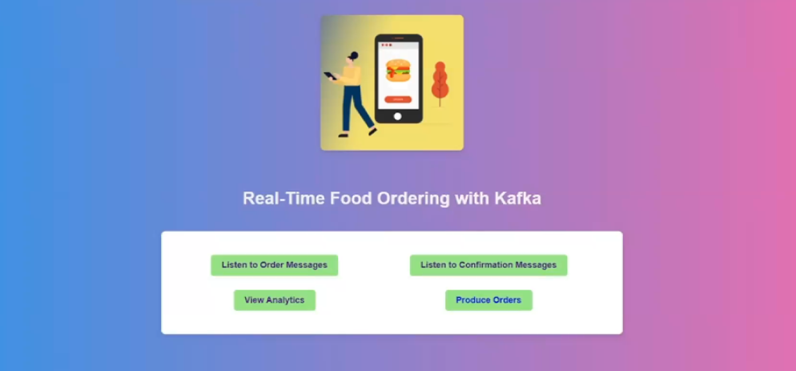

# Kafka Food Ordering Analytics

<<<<<<< HEAD

=======

>>>>>>> 3ae625f41fcbfeda87b88af11a89d40932a0cfe8

This project utilizes Apache Kafka to analyze food ordering data in real-time. By processing streams of data from various sources such as online platforms and POS systems, businesses can gain valuable insights into customer preferences, order trends, and operational efficiency. Kafka's distributed streaming platform enables seamless data processing and analysis, empowering food businesses to make data-driven decisions for better customer satisfaction and revenue growth.

